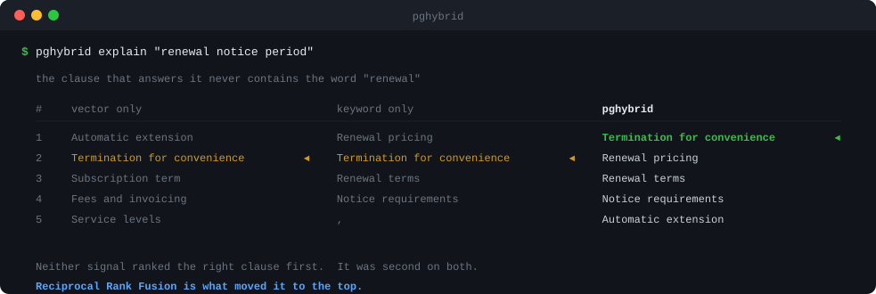

# pghybrid

**Hybrid search on the Postgres you already have.**

Vector similarity + full-text search, combined by Reciprocal Rank Fusion, on plain
`pgvector`. No `pg_search`, no VectorChord, no Elasticsearch, no vector database, no
extension you need superuser to install.

<!-- Registry badges are added at the first release. Until the packages exist,
     shields.io renders them as red "package not found", which reads as broken. -->
[](https://github.com/pavangupta352/pghybrid/actions/workflows/ci.yml)
[](LICENSE)
[](https://www.postgresql.org/)
[](https://github.com/pgvector/pgvector)

---

## The problem, in one picture

<p align="center">
  
</p>

A contract. Someone asks **"renewal notice period"**. The clause that answers it says
*"sixty days written notice prior to the anniversary date"* — it never uses the word
*renewal*.

Semantic search puts a plausible-but-wrong clause first. Keyword search puts the clause
that *uses all three words and answers none of them* first. The right answer is second on
both, and first on neither — which is exactly the case rank fusion exists to fix.

That image is generated from a live query by
[`scripts/make_demo_svg.py`](scripts/make_demo_svg.py), which refuses to draw itself if
fusion stops surfacing the right clause. Reproduce it yourself in about a minute:
[`examples/`](examples/).

## Why this exists

Hybrid search on Postgres is a solved problem *if you can install a C extension*.
`pg_search`, VectorChord and `pg_textsearch` are all excellent, and all of them are
extensions. On managed Postgres you usually cannot install extensions at all.

**`pgvector` is available almost everywhere. BM25 extensions are available almost nowhere.**

| | pgvector | `pg_search` (ParadeDB) | **pghybrid** |
|---|---|---|---|
| Amazon RDS | ✅ | ❌ not in the extension allowlist | ✅ |
| Amazon Aurora | ✅ | ❌ | ✅ |
| Google Cloud SQL | ✅ | ❌ | ✅ |
| Azure Database | ✅ | ❌ | ✅ |
| Supabase | ✅ built in | ❌ [no integration](https://supabase.com/partners/paradedb) — needs replication to a separate instance | ✅ |
| Neon | ✅ | ❌ [removed for new projects, March 2026](https://neon.com/docs/extensions/pg_search) | ✅ |
| Heroku Postgres | ✅ | ❌ | ✅ |
| Self-hosted | ✅ | ✅ | ✅ |

This is the whole pitch. It is **not** *"better search than ParadeDB"* — `pg_search`'s BM25
is genuinely better than `ts_rank_cd`, and if you can install it, you probably should.
This is *"search you can actually install."*

## Install

```bash
pip install pghybrid          # Python
npm install pghybrid          # TypeScript / JavaScript
```

Zero runtime dependencies in both. `pghybrid` generates SQL and hands it to the driver you
already use — psycopg, asyncpg, SQLAlchemy, node-postgres, Drizzle, Supabase. It never
opens a connection of its own and never calls an embedding provider.

Or **install nothing at all**: [`sql/hybrid_search.sql`](sql/hybrid_search.sql) and
[`sql/migration.sql`](sql/migration.sql) are complete, commented and standalone. Paste them
into the Supabase SQL editor and you are done. Copying them instead of installing the
package is a supported way to use this project.

## 30-second quickstart

```bash
pghybrid init --dsn $DATABASE_URL --table chunks     # inspects your table, writes the migration
```

```python
from pghybrid import Config, HybridSearch

search = HybridSearch(
    Config(table="chunks", text_column="content", vector_column="embedding",
           tsvector_column="fts", paramstyle="pyformat"),
    execute=lambda sql, params: conn.execute(sql, params).fetchall(),
)

for row in search.search("renewal notice period", embedding=query_vector, limit=10):
    print(row.score, row.get("title"))
```

```ts
import { Config, HybridSearch } from "pghybrid";

const search = new HybridSearch(
  { table: "chunks", textColumn: "content", vectorColumn: "embedding", tsvectorColumn: "fts" },
  (sql, params) => pool.query(sql, params).then((r) => r.rows),
);

const rows = await search.search("renewal notice period", { embedding, limit: 10 });
```

You pass the embedding in. `pghybrid` never calls a model, so it works with OpenAI, Cohere,
Voyage, a local sentence-transformer, or anything else — and it needs no API key.

### Your driver, in one line

Writing that `execute` closure yourself is fine, but it means choosing a placeholder
style — and `$1` and `%s` are not interchangeable. Get it wrong and the error talks about
parameter counts, not about the cause. The adapters set it for you:

```python
from pghybrid.adapters import for_psycopg, for_asyncpg, for_sqlalchemy, for_django

search = for_psycopg(conn, table="chunks", text_column="content", vector_column="embedding")
search = for_sqlalchemy(session, ...)      # Session, Connection or Engine
search = for_django(using="default", ...)  # Django's connection, by alias
search = for_asyncpg(pool, ...)            # returns an AsyncHybridSearch
```

```ts
import { forPg, forPostgresJs, forDrizzle, forKysely } from "pghybrid";

const search = forPg(pool, config);              // node-postgres
const search = forPostgresJs(sql, config);       // postgres.js
const search = forDrizzle(db, config);           // via Drizzle's underlying client
const search = forKysely(db, config);            // via a raw compiled query
```

Every one of these is tested against a real server and asserted to return **the same rows
in the same order with the same scores** — a driver is a transport, not a dialect.

Prisma is not in that list because it has not been run here, and this project does not
ship adapters it has not executed. It is one line, and it works:

```ts
const search = new HybridSearch(config, (sql, params) => prisma.$queryRawUnsafe(sql, ...params));
```

## Two decisions that make it work

Most hand-rolled Postgres hybrid search is subtly broken in the same two ways.

### 1. Your weights are lying to you

This is the shape almost everyone writes:

```sql
0.7 * (1 - (embedding <=> $1)) + 0.3 * ts_rank_cd(fts, query)
```

It reads as *70% semantic, 30% keyword*. It is not. Cosine distance is bounded in `[0,1]`
and clusters tightly — your top 50 candidates might all sit between 0.62 and 0.81, a span
of 0.19. `ts_rank_cd` is **unbounded** and on short chunks typically lands near 0.02.

The weights describe the constants, not the influence. **Tuning them cannot fix it**,
because the spans are set by the scoring functions, and `ts_rank_cd`'s span shifts with
document length and corpus statistics.

`pghybrid explain` measures it on your own data, for both fusion methods at once:

```
  effective weights · the share of the score range each signal controls

  fusion      signal    rows  weight   nominal     contribution range       span  effective
  ─────────────────────────────────────────────────────────────────────────────────────────
  rrf ▸       vector   12/12     0.7     70.0%      0.00972 … 0.01148    0.00175      71.7%
              text     12/12     0.3     30.0%      0.00423 … 0.00492    0.00069      28.3%
              configured 70/30 → measured 72/28  ·  vector moves the score 2.5x further than text
  weighted    vector   12/12     0.7     70.0%      0.06347 … 0.69214    0.62867      75.0%
              text     12/12     0.3     30.0%      0.03000 … 0.24000    0.21000      25.0%
              configured 70/30 → measured 75/25  ·  vector moves the score 3.0x further than text
```

Reciprocal Rank Fusion combines **ranks**, which share a scale by construction, so the
weights mean roughly what they say:

```
score = Σ  weight / (k + rank)
```

`k = 60` is from [Cormack, Clarke & Buettcher (2009)](https://dl.acm.org/doi/10.1145/1571941.1572114).

That run uses a query whose terms reach every row, so both signals have full
coverage (`12/12`) and the comparison is about scale alone. The corpus places its
vectors evenly by hand — which is
the *best* case for weighted fusion, and the gap is still visible. On real embeddings it
is wider, because real cosine similarities bunch into a narrow band while `ts_rank_cd`
does not. Do not take a number from this README; run `explain` on your own index, which
is the entire reason the command exists.

`explain` also separates a second effect that is easy to mistake for the first. If one
signal matched far fewer rows than the other, it is doing more of the discriminating work
in that result set regardless of any weight you set — the header line reports coverage
(`12 by vector · 4 by text · 4 by both`) so you can tell a **scale** problem, which
switching to RRF fixes, from a **coverage** one, which it does not and should not.

### 2. Your keyword search matches nothing

Every Postgres query parser combines terms with **AND**. `websearch_to_tsquery` turns
`renewal notice period` into `'renew' & 'notic' & 'period'` — documents must contain all
three.

For a filter that is correct. For the keyword half of a hybrid search it is quietly
destructive: a four- or five-word question usually matches **nothing**, the keyword signal
contributes no ranking at all, and your hybrid search silently degrades into vector-only
search without reporting that anything went wrong.

In the demo corpus above, AND semantics return exactly **one** row. `pghybrid` OR-s the
terms by default, and precision comes back through ranking rather than exclusion:

```python
Config(..., text_match="any")   # default
Config(..., text_match="all")   # Postgres' native AND, if you want it
```

The naive way to do this — rewriting `&` into `|` inside a parsed tsquery — is wrong, and
`pghybrid` does not do it: `'a' & !'b'` becomes `'a' | !'b'`, which matches every document
that merely lacks `b`. Terms are tokenised and OR-combined individually, so quoted
`"phrases"` and `-negation` keep working.

## Find out which stage lost the answer

`explain` decomposes a single result set: both ranks, both raw scores, each signal's
contribution to the fused score, and — the part nobody else shows — the **near-miss band**,
the rows ranked just below your cut-off.

```
$ pghybrid explain "renewal notice period" --limit 4 --near-miss 3

  pghybrid explain · chunks

  query       "renewal notice period" · embedding 8 dims
  fusion      rrf · k 60 · weights vector 1.0 / text 1.0
  candidates  50 per signal → 12 fused · 12 by vector · 4 by text · 4 by both
  signals     cosine distance 0.01123 … 0.90933 · ts_rank_cd 0.10000 … 0.60000
  window      top 4 · near-miss band of 3

                                                     vector                     text             final
       #  id  title                         rank  distance   contrib  rank   ts_rank   contrib     score
  ──────────────────────────────────────────────────────────────────────────────────────────────────────
       1   2  Termination for convenience      2   0.03894   0.01613     2   0.30000   0.01613   0.03226
       2   7  Renewal pricing                  7   0.36285   0.01493     1   0.60000   0.01639   0.03132
       3   8  Renewal terms                    8   0.45970   0.01471     2   0.30000   0.01613   0.03083
       4   6  Notice requirements              6   0.27516   0.01515     4   0.10000   0.01562   0.03078
  ╌╌╌╌╌╌╌╌╌╌╌╌╌╌╌╌╌╌╌╌╌╌╌╌╌╌╌╌╌╌╌╌╌╌╌╌╌╌╌ near miss · ranks 5–7 ╌╌╌╌╌╌╌╌╌╌╌╌╌╌╌╌╌╌╌╌╌╌╌╌╌╌╌╌╌╌╌╌╌╌╌╌╌╌╌╌
       5   1  Automatic extension              1   0.01123   0.01639     –         –         0   0.01639
       6   3  Subscription term                3   0.07894   0.01587     –         –         0   0.01587
       7   4  Fees and invoicing               4   0.13218   0.01562     –         –         0   0.01562
  ──────────────────────────────────────────────────────────────────────────────────────────────────────
  5 further candidates fused below this window
```

And when a document you *know* is in there does not come back:

```
$ pghybrid explain "renewal notice period" --find "sixty days written notice"

  find · "sixty days written notice"

    id 2 · Termination for convenience
    returned at #1 — the query found it
    #2 by vector (distance 0.03894) · #2 by text (ts_rank_cd 0.30000)
```

And when the text is not there at all, it says so in those words rather than leaving you
to infer it from an empty result:

```
  find · "force majeure pandemic clause"

    no row in chunks contains that text (searched content, title)
    → the chunk is not in the table, so no amount of ranking will retrieve it
      — check ingestion and chunking, not the weights
```

Or when it is indexed but lost the ranking:

```
  find · "commercially reasonable efforts"

    id 5 · Service levels
    fused at #8 of 12 candidates, below the near-miss band
    #5 by vector (distance 0.19790) · no text match
    → widen the report with near_miss=6 to see what outranks it
```

That single command separates *"the chunk was never indexed"* from *"the chunk was
outranked"* — two completely different bugs that look identical from the outside.

## Grade the index you already have

```
$ pghybrid doctor --dsn $DATABASE_URL --table documents

SWEEP  recall@10 and latency at each setting
------------------------------------------------------------------------------
  ivfflat.probes          recall         p50         p95
  1                         0.12     0.18 ms     0.46 ms  <- current, pgvector's default
  2                         0.14     0.28 ms     0.96 ms
  14                        0.36     0.46 ms     0.77 ms
  20                        0.42     0.57 ms     0.83 ms
  50                        0.68     0.76 ms     0.87 ms
  Latency is measured client-side, so it includes one round trip per query.

FINDINGS
------------------------------------------------------------------------------
  [error] recall@10 = 0.12 over 25 sampled queries
        The index is losing most of the right answers: about 8.8 of every 10
        results are not among the true nearest neighbours.
        fix: Raise ivfflat.probes; the sweep shows what each value costs in
             latency.
```

That is a real run against 20,000 rows behind an `ivfflat` index built with `lists = 200`.
At the default of one probe the index was returning **12% of the right answers** and
reporting no error, because an under-tuned vector index does not fail — it silently
returns worse results. Recall is measured against exact search on query vectors sampled
from the table itself, so it needs no labelled data.

`doctor` reads the real shape of your table and tells you what to change, with the
arithmetic shown so you can defend the choice:

- the index to create, and why — `lists = rows/1000` up to 1M rows and `sqrt(rows)` above
  it, a threshold that is very commonly applied on the wrong side
- **measured** recall@k against exact search, not a guess
- an `ef_search` / `probes` sweep so you pick your own point on the recall/latency curve
- queries silently falling back to a sequential scan, naming the filter that caused it
- filtered recall specifically — approximate indexes collapse under selective filters, which
  is where most multi-tenant applications live, and pgvector 0.8's
  [iterative index scans](https://github.com/pgvector/pgvector#iterative-index-scans) are
  the fix

It is read-only by default and will not write to your database without an explicit flag.

## The generated SQL

Nothing is hidden. `pghybrid` builds one statement, and you can always read it, copy it,
and stop using the package.

<details>
<summary><strong>Show the generated SQL</strong></summary>

See [`sql/hybrid_search.sql`](sql/hybrid_search.sql) for the same query, heavily commented
and ready to paste. In code:

```python
sql, params = search.build_query("renewal notice period", embedding=vec, limit=10)
print(sql)
```

Three things in it are load-bearing:

- **Filters go inside both candidate CTEs**, not after the fusion. Filtering afterwards
  throws away rows that were already ranked, so you ask for ten results and get four.
- **The join is `FULL OUTER`.** An inner join reduces hybrid search to the *intersection*
  of the two result sets, so a document only one signal found can never compete.
- **`ts_headline` runs only on the final page.** It re-parses the document text, so
  evaluating it inside a candidate CTE pays that cost for every candidate.

</details>

## Configuration

| option | default | what it does |
|---|---|---|
| `table`, `text_column`, `vector_column` | — | required |
| `id_column` | `"id"` | primary key |
| `tsvector_column` | `None` | a stored tsvector column. Omitted, the tsvector is computed inline: no migration needed, but no GIN index either |
| `language` | `"english"` | text search config. Use `"simple"` for identifiers, product codes and mixed-language corpora |
| `text_match` | `"any"` | `"any"` OR-s terms, `"all"` keeps Postgres' AND |
| `fusion` | `"rrf"` | or `"weighted"`, kept so `explain` can show you what it does |
| `k` | `60` | the RRF constant |
| `weights` | `1.0 / 1.0` | relative influence of each signal |
| `candidate_limit` | `50` | rows each signal contributes to the fusion |
| `metric` | `cosine` | `cosine`, `l2`, `inner_product`, `l1` |
| `vector_type` | `"vector"` | `"halfvec"` halves index size and build time, usually free on recall |
| `recency` | `None` | `Recency(column, half_life_days)` — exponential decay on the fused score |
| `paramstyle` | `"numeric"` | `$1` for asyncpg / node-postgres / raw SQL, `"pyformat"` (`%s`) for psycopg |
| `filter_columns` | `[]` | columns you may filter on; anything else is rejected rather than interpolated |

## Requirements

- PostgreSQL 12+
- `pgvector` 0.5+ (0.8+ recommended, for iterative index scans)
- Python 3.9+ / Node 18+

No other extension. That is the point, and it is asserted by a test that runs against a
stock `pgvector/pgvector:pg17` image with only `plpgsql` and `vector` installed.

## Prior art, credited

- **[ParadeDB `pg_search`](https://github.com/paradedb/paradedb)** — real BM25 in Postgres,
  and better at ranking than anything built on `ts_rank_cd`. Use it if you can install it.
- **[VectorChord](https://github.com/tensorchord/VectorChord)** and TigerData's
  **`pg_textsearch`** — also excellent, also extensions.
- **[`pg-hybrid-rrf`](https://github.com/BruceMong/pg-hybrid-rrf)** by Bruce Mong got to the
  scale-mismatch argument first and stated it clearly. The `effectiveWeights` idea in that
  README is a good one and this project's `explain` owes it a debt.
- The near-miss band is an idea worth stealing from every query planner ever written.

## Contributing

Bug reports and pull requests welcome — see [CONTRIBUTING.md](CONTRIBUTING.md). The test
suite runs against a real Postgres in Docker:

```bash
docker compose up -d
pytest                     # Python
npm test --prefix js       # TypeScript
```

## License

MIT © Pavan Gupta
